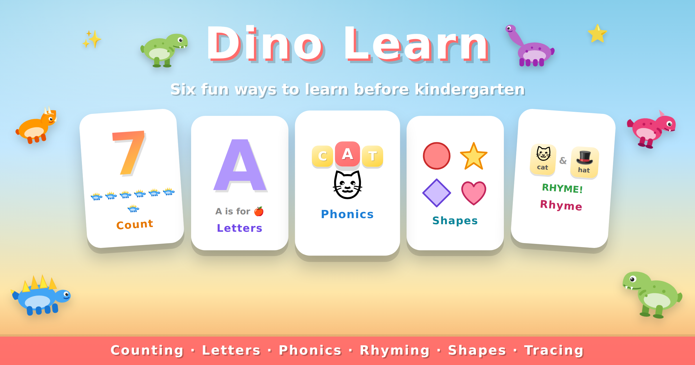

<p align="center">
  
</p>

# Dino Learn

A web-based learning app for preschoolers (ages ~3–6), built as six bite-sized
mini-apps inside a single static site. Designed around real kindergarten
report-card gaps: counting, letter recognition, phonics blending, rhyming,
shape recognition, and writing your own name.

> **No build step. No backend. No npm.** Double-click `index.html` and it works.

---

## What's inside

Six learning apps, each with its own menu and a consistent **Learn / Test** blueprint:

| Tile | What it teaches | Modes |
|---|---|---|
| 🦖 **Counting** | Numbers 1–10 and 11–20 (with a place-value "ten pack" visualization) | Learn · Listen Test · Look Test |
| 🦕 **Letters** | A–Z and a–z (toggle between cases) with "A is for Apple" associations | Learn · Test |
| 🔊 **Phonics** | 20 CVC words (cat, dog, pig…) — sounds each letter then blends them | Learn · Test |
| 🎵 **Rhyming** | "Do these words rhyme?" — 26 pairs including all 8 from a real K-screener | Learn · Test (with **Ears Only** drill) |
| ⭐ **Shapes** | All 9 classroom shapes (Rectangle & Oval drawn at matching proportions so the kid sees corners vs curves) | Learn · Listen Test · Look Test |
| ✏️ **Write My Name** | Trace each letter of a custom name with finger or mouse | Free-paint over a faded letter template |

**Two kinds of tests:**

- **Listen Test** — the app *says* the answer; the kid taps the matching tile.
- **Look Test** — the app *shows* the answer; the kid says it aloud; parent taps "✓ Knew it!" or "🤔 Help me" (parent-mediated, no microphone needed).

---

## How to use it

1. Download or clone the repo.
2. Open `index.html` in any modern browser (Chrome, Safari, Firefox, Edge).
3. Tap a colorful landing tile to enter that mini-app.
4. **Tap anywhere once on the first screen** — browsers require a user gesture before they'll play TTS audio.

### The Counting menu
- Toggle range: **1–10** or **11–20**.
- **Learn** flips through cards. Each number draws on (SVG pen animation) and is spoken: *"This is the number… seven."* For 11–20 the dinos arrange as a dashed **ten-pack + extras**, teaching place value visually.
- **Listen Test** — *"Tap the number you hear!"* — random number from the active range; pick from 4 tiles.
- **Look Test** — *"What number is this?"* — see the numeral; the answer (word + dinos) reveals when you tap ✓ Knew it! or 🤔 Help me.

### The Letters menu
- Toggle case: **ABC** or **abc**. The drawn letter, caption ("a is for apple"), and test choices all switch case.
- Learn mode says "This is capital A. A is for Apple." (or "This is lowercase a…") with explicit pauses between phrases so the letter has room to land.

### The Phonics menu
- Learn: 3 letter boxes light up red one-at-a-time as their sound plays (*kuh, ah, tuh*), then all light up together as the whole word is spoken (*CAT!*).
- Test: hear a sounded-out word, tap the matching emoji+word tile.

### The Rhyming menu
- Toggle display: **👁 Show** (default; words visible) or **👂 Ears Only** (word text hidden so the kid has to *listen* for the rhyme, not pattern-match letter endings).
- Learn cards reveal "They Rhyme!" or "They Don't Rhyme" in green/red after speaking both words.
- Test shows two emojis with `?` between, kid taps **✓ Yes, rhyme!** or **✗ Don't rhyme**.

### The Shapes menu
- Three modes (Learn / Listen Test / Look Test) just like Counting.
- All 9 K-classroom shapes: Circle, Square, Rectangle, Triangle, Star, Heart, Diamond, Oval, Hexagon.

### The Write My Name menu
- First time: type your kid's name and tap **Start Tracing**. Auto-uppercases. Saved to localStorage for next time.
- Progress chips at the top show the current letter (yellow, raised) and completed letters (green).
- Big card shows the letter as a wide gray "track" with a dashed centerline guide. Finger or mouse drag paints colored ink — no strict hit-detection; the wide track is a soft boundary, not a punishment.
- 🧹 Clear · 🔊 Hear it · ▶ Next. Last letter triggers a "You wrote your name!" celebration with confetti.

---

## Customizing for your kid

The app defaults to a dinosaur theme and to the name "DECLAN". To rename:
- **Kid's name (tracing)** — type a new name in the input on the tracing menu. Persists across reloads.
- **Avatar / theme** — fork the repo and edit `dinos.js` (the 5 dino SVGs) and the title-bar emoji in `index.html` for a different aesthetic.
- **Additional words/letters/shapes** — extend the arrays in `chars.js`, `phonics.js`, `rhyming.js`, or `shapes.js`. The renderer picks them up automatically.

---

## Architecture (for tinkerers)

Static client-side only. **Zero dependencies at runtime.**

```
index.html       Every screen for every app (sections toggled by .active class)
styles.css       All styling, with consistent kid-friendly patterns
app.js           All logic — screen routing, handlers, speech, canvas
chars.js         SVG path data for 0–9, A–Z, a–z (drawn by stroke-dashoffset)
dinos.js         5 cartoon dino SVGs
phonics.js       20 CVC words with phonetic sounds + emoji
rhyming.js       26 word pairs (rhyme: true/false) + emojis
shapes.js        9 inline shape SVGs
tests/           Data integrity + Playwright integration tests
```

Key choices that pay off:
- **Web Speech API** for all audio — no asset pipeline, no MP3s.
- **Inline SVG + emoji** for all art — no images to manage.
- **Chunked TTS with explicit pauses** (`sayAsync` + `sleep` helpers, with a play-token to cancel stale sequences).
- **All "next round" timers routed through `scheduleScreenAction`** so back-navigation can cancel them in one call (otherwise they fire on the wrong screen).
- **`localStorage` wrapped in try/catch** so Safari Private Browsing doesn't break the Name app.

---

## Tests

Two test suites, both run with stock Node and the bundled Playwright:

```sh
node tests/data.test.js                                 # 24 data-integrity checks
NODE_PATH=$(npm root -g) node tests/integration.test.js # 22 browser-driven checks
```

Integration tests include regression coverage for every bug caught in the
post-build code review (back-nav speech cancel, stale-timer leaks,
localStorage failure, mid-pause interruption). See [`tests/README.md`](tests/README.md).

---

## Roadmap ideas

Open invitations rather than commitments:
- A dedicated "Colors" tile (currently mastered by my kid so was deprioritized)
- A "sight words" tile pairing word + emoji for whole-word recognition
- Multiplayer / two-kid mode (turn-taking between siblings)
- Optional simple progress logging (per-letter and per-shape accuracy over time) — opt-in, stored locally

If you fork this for your own kid, the smart move is to **build one new tile, try it, then iterate** — that's how this repo got from "Counting only" to six apps.
